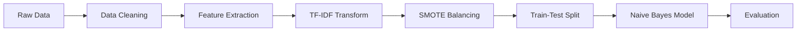

# 📧 Email Spam Classifier

A Machine Learning project for email spam classification using Naive Bayes algorithm with TF-IDF transformation and SMOTE data balancing techniques.

[](https://www.python.org/)
[](https://scikit-learn.org/)
[](LICENSE)

## 📊 Overview

This project builds a Machine Learning model to classify emails as **Spam** or **Ham** (legitimate emails) with high accuracy. The dataset contains 5,172 emails vectorized with 3,000 keyword features.

### ✨ Key Features

- 📈 Detailed data analysis with 6 visualization charts
- 🧹 Data preprocessing: cleaning, TF-IDF transformation
- ⚖️ Data balancing with SMOTE
- 🤖 Multinomial Naive Bayes model
- 📊 Comprehensive evaluation: Confusion Matrix, ROC Curve, Classification Report

## 🚀 Kết quả

- **Accuracy**: ~98%
- **AUC Score**: 0.99+ (Xuất sắc)
- **F1-Score**: Cao trên cả hai lớp

## 📁 Project Structure

```
email-spam-classifier/
├── email_data_analysis.ipynb    # Complete ML pipeline notebook
├── requirements.txt             # Python dependencies
├── LICENSE                      # MIT License
└── README.md                    # This file
```

> **Note**: Dataset file (`emails.csv`) is not included in this repository. You need to prepare your own email dataset.

## 🛠️ Installation

### 1. Clone repository

```bash
git clone https://github.com/ThinhPhan06/email-spam-classifier.git
cd email-spam-classifier
```

### 2. Create virtual environment (recommended)

```bash
python -m venv .venv
# Windows
.venv\Scripts\activate
# Linux/Mac
source .venv/bin/activate
```

### 3. Install dependencies

```bash
pip install -r requirements.txt
```

### 4. Prepare your dataset

You need an email dataset in CSV format with the following structure:
- `text`: Email content
- `spam`: Label (0 for Ham, 1 for Spam)

Place your dataset file (e.g., `emails.csv`) in the project directory.

## 📦 Dependencies

```txt
pandas>=1.5.0
numpy>=1.23.0
matplotlib>=3.6.0
seaborn>=0.12.0
scikit-learn>=1.2.0
imbalanced-learn>=0.10.0
jupyter>=1.0.0
```

## 💻 Usage

1. Launch Jupyter Notebook:
```bash
jupyter notebook
```

2. Open `email_data_analysis.ipynb` and run cells sequentially from 1 → 17:
   - **Cells 1-6**: Data analysis and visualization
   - **Cells 7-12**: Preprocessing (TF-IDF, SMOTE, train-test split)
   - **Cells 13-17**: Model training and evaluation

## 📊 Processing Pipeline



### Detailed Steps:

1. **Data Loading**: 5,172 emails with 3,000 features
2. **Data Cleaning**: Remove duplicates and outliers
3. **TF-IDF**: Transform bag-of-words → weighted features
4. **SMOTE**: Balance data (Ham 71% → 50%, Spam 29% → 50%)
5. **Train-Test Split**: 80% train, 20% test (stratified)
6. **Model Training**: Multinomial Naive Bayes
7. **Evaluation**: Confusion Matrix, ROC Curve, Classification Report

## 📈 Detailed Results

### Confusion Matrix
```
                Predicted
              Ham    Spam
Actual Ham    XXX     XX
       Spam    XX    XXX
```

### Classification Report
```
              precision    recall  f1-score   support

         Ham       0.98      0.99      0.99       XXX
        Spam       0.98      0.96      0.97       XXX

    accuracy                           0.98      XXXX
   macro avg       0.98      0.98      0.98      XXXX
weighted avg       0.98      0.98      0.98      XXXX
```

### Top 20 Spam Keywords
The model identifies the most important keywords for spam classification such as: "free", "win", "click", "money", etc.

## 🧪 Techniques Applied

- **TF-IDF (Term Frequency-Inverse Document Frequency)**: Keyword weighting
- **SMOTE (Synthetic Minority Over-sampling Technique)**: Balance class imbalance
- **Stratified Split**: Ensure uniform train/test distribution
- **Multinomial Naive Bayes**: Suitable for text classification

## 📚 References

- [Scikit-learn Documentation](https://scikit-learn.org/)
- [Imbalanced-learn SMOTE](https://imbalanced-learn.org/stable/references/generated/imblearn.over_sampling.SMOTE.html)
- [Naive Bayes for Text Classification](https://scikit-learn.org/stable/modules/naive_bayes.html)

## 🤝 Contributing

Contributions, issues and feature requests are welcome!

1. Fork the project
2. Create your feature branch (`git checkout -b feature/AmazingFeature`)
3. Commit your changes (`git commit -m 'Add some AmazingFeature'`)
4. Push to the branch (`git push origin feature/AmazingFeature`)
5. Open a Pull Request

## 📝 License

This project is released under the [MIT License](LICENSE).

## 👤 Author

**Thinh Phan**

- GitHub: [@ThinhPhan06](https://github.com/ThinhPhan06)
- Email: thinhphucphan.angiang@gmail.com

## ⭐ Show your support

Give a ⭐️ if this project helped you!

---

<div align="center">
Made with ❤️ and Python
</div>


